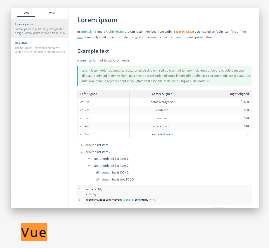
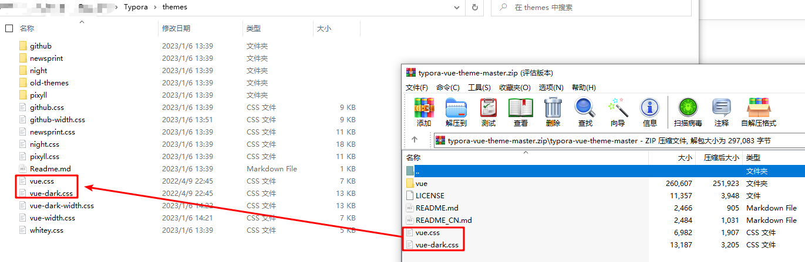
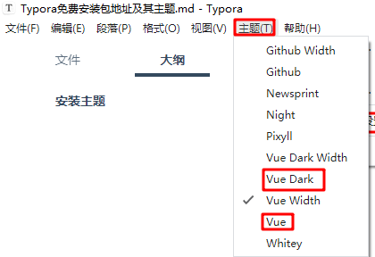

### 安装主题

>   官网主题推荐
>
>   https://theme.typoraio.cn/

> 使用主题
>
> 1.   下载主题并解压
>
>      
>
> 2.   将CSS文件拷贝到Typora主题目录
>
>      
>
>      

> 个人推荐修改点
>
> -   宽屏
>
>     >   修改css中所有宽度width为100%，即可将预览页面调整到宽屏