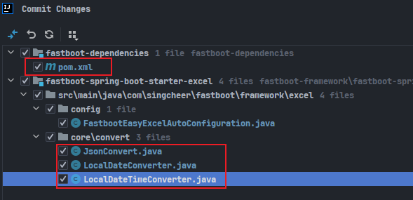
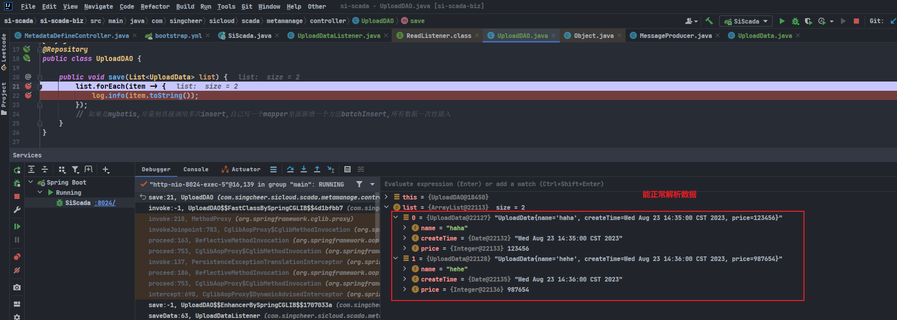
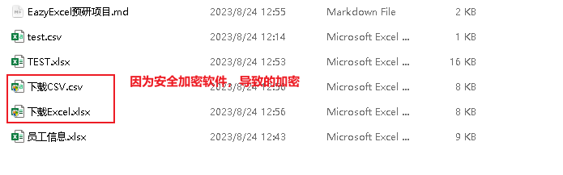
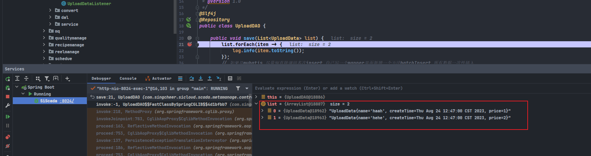
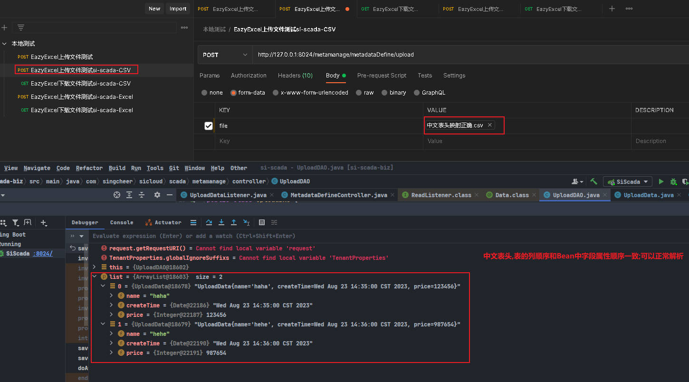
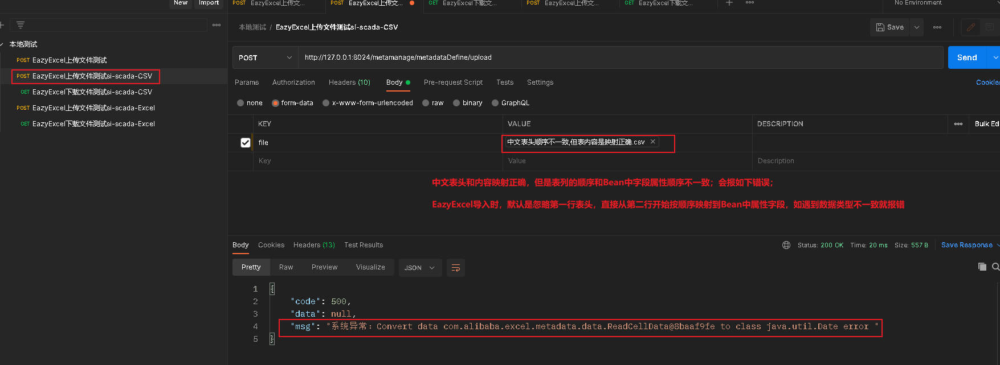
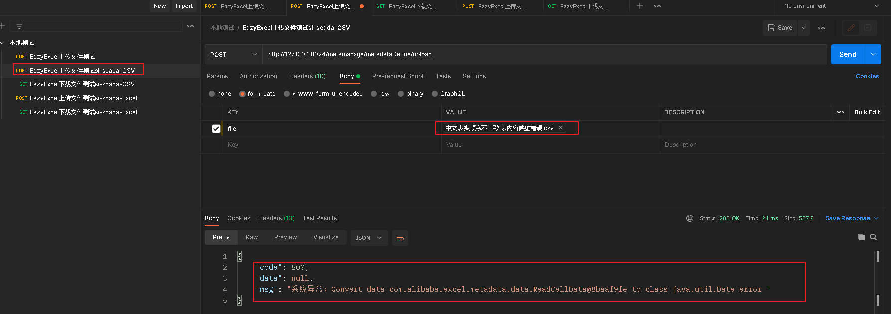
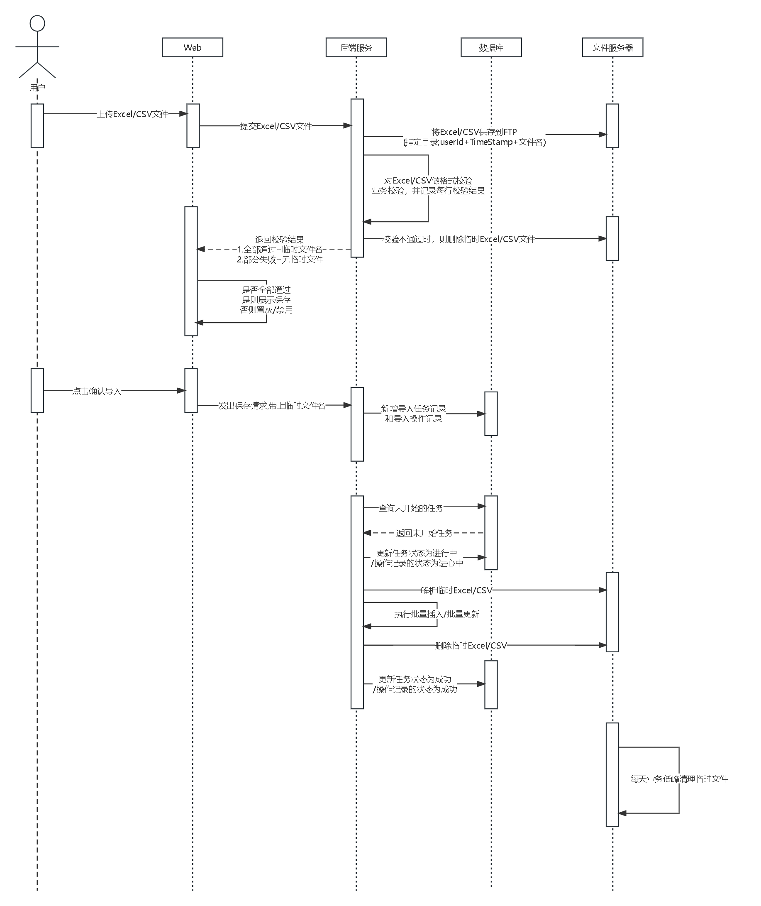
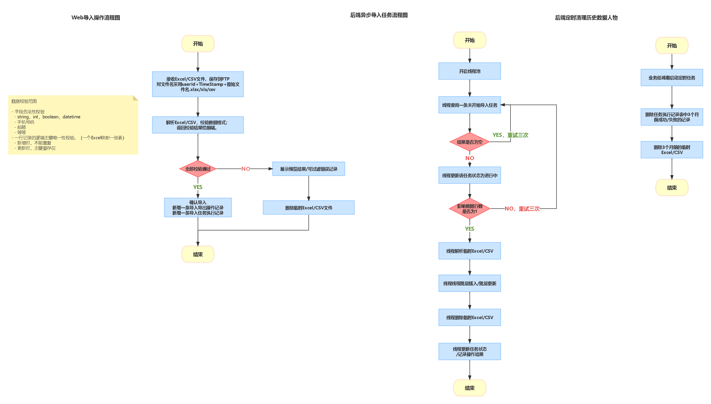

# EasyExcel预研

## 预研目标

> 目前项目`fastboot-parent`里面已经有`excel组件`，但是技术比较老，现在是想预研`EasyExcel`是否具备Excel和CSV（最好是能支持，不能支持看是否有备选方案）的导入导出能力，能否集成到`fastboot-parent`中新增一个组件。
>
> 
>
> 不是把之前的老的Excel组件替换成EasyExcel，而是把`EasyExcel`集成到`fastboot-parent`中，现在的版本有需求涉及Excel/CSV导入导出能力，然后直接使用这个新组件。

> 技术实现手段：
>
> - 使用`si-scada`项目引入`EasyExcel`，是否有版本兼容性问题。<strong style="color:green">添加依赖OK，可以正常启动</strong>
> - 编写Excel/CSV导入导出，4个Controller接口。<strong style="color:green">支持Excel/CSV，准备编写测试用例</strong>
> - 使用PostMan验证。<strong style="color:green">CSV验证OK</strong>

> fastboot-dependencies修改EasyExcel的版本号
>
> 重构验证json，Date，DateTime转换类
>
> 

# EasyExcel技术评审

> 目标：支持Excel和CSV的导入导出和解析
>
> 现状是EasyExcel版本为2.2.7
>
> 技术选型策略：看EasyExcel的最新release版本是否支持Excel和CSV，然后API是否向前兼容。（既解决Excel/CSV同时支持，又尽量少修改历史代码；避免切换新jar包，历史代码需要适配修改的问题）

> 修改点：
>
> http://47.92.146.195:40462/unified-platform/fastboot/-/merge_requests/33
>
> 1. EazyExcel版本2.2.7升级到3.3.2
> 2. 涉及到的代码修改（主要是api变化导致适配修改，对现有逻辑无影响。）

> 集成到si-scada-biz中测试验证
>
> 1. CSV导入测试。
> 2. CSV导出测试。
> 3. Excel导入测试。
> 4. Excel导出测试。

# 导入导出组件预研

## 目标

- 导入导出只支持二维表格，表格中都是文本数据（不支持插入图片等二进制数据）
- 后端开发定义好导入导出表的表头(列)
- 导入->预览->确认导入->后端处理（新增/修改）
- 查询->导出
- 下载导入模板

## 测试要点

- 后端开发定义OV/DTO/Bean对象
- 暴露Query/Import/Preview/Save/Export五个接口
  - Query查询表头，前端生成Excel/CSV的导入模板。（待定.../宏林说是产品经理定义的,不需要开发实现）
  - Import导入数据，生成临时数据/文件
  - Preview预览，查询临时数据/文件
  - Save保存，临时数据插入/更新
  - Export导出数据，后端返回查询结果，前端生成Excel/CSV文件。

# 后端Bean定义

```java
@Data
@EqualsAndHashCode
public class DownloadData {

    @ExcelProperty(value = "名称",index = 0)
    @NotBlank(message = "名称不能为空")
    @Length(max = 20, message = "名称长度不能超过20")
    @ApiModelProperty(value = "名称", required = true,example = "测试001abc", position = 0)
    private String name;

    @ExcelProperty(value = "创建时间",index = 1,converter = LocalDateTimeConverter.class)
    @ApiModelProperty(value = "创建时间", required = true,example = "2023-08-28 16:01:00", position = 1)
    private Date createTime;

    @ExcelProperty(value = "价格",index = 2)
    @ApiModelProperty(value = "价格", required = true,example = "123", position = 2)
    private Integer price;
}

// 注解里面定义了value为表头的中文名称,position为表的第几列,example为导出模板的样例
```

`@ExcelProperty(value = "创建时间",index = 1,converter = LocalDateTimeConverter.class)` 定义导出的表头,第几列,格式转换

`读Excel/CSV不根据表头来映射Bean字段,而是根据顺序读取`

```txt
-------------------------------表头英文跟Bean中属性字段映射顺序保持一致-------------------------------
name,createTime,price
haha,2023-08-23 14:35:00,123456
hehe,2023-08-23 14:36:00,987654


-------------------------------中文表头映射正确.csv-------------------------------
名称,创建时间,价格
haha,2023-08-23 14:35:00,123456
hehe,2023-08-23 14:36:00,987654

-------------------------------中文表头顺序不一致,但表内容是映射正确.csv-------------------------------
名称,价格,创建时间
haha,123456,2023-08-23 14:35:00
hehe,987654,2023-08-23 14:36:00

-------------------------------中文表头顺序不一致,表内容映射错误.csv-------------------------------
价格,名称,创建时间
haha,123456,2023-08-23 14:35:00
hehe,987654,2023-08-23 14:36:00

```








## 找一个满足上面要求的开源项目

- 流程图
- 时序图
- 导入时只能全部新增/全部更新
- 更新前后内容一致的更新，是否允许？？？
- 数据校验范围
  - 字段合法性校验
    - string，int，boolean，datetime
    - 手机号码
    - 邮箱
    - 等等
  - 一行记录的逻辑主键唯一性校验。（一个Excel映射一张表）
    - 新增时，不能重复
    - 更新时，主键要存在
- 预览数据校验结果
  - 每一行的校验结果；失败原因。（若有多因，至少显示一条原因）
  - 仅全部校验通过后，才能确认导入。
  - 真正的导入操作采用异步任务执行。（流程图需要补充异步任务队列的部分）





# 导入导出基础表设计

## 导入导出操作记录表

`Import_Export_records`

| 列名                 | 名称(中文)                        | 数据类型   | 样例                                                      |
| -------------------- | --------------------------------- | ---------- | --------------------------------------------------------- |
| ID                   | 主键ID                            | uuid       | 163CDFFE-5F4B-334A-5FB5-DEEAE81E9A24                      |
| tenant_id            | 用户ID                            | bigint     | 001                                                       |
| customer_name        | 用户名称                          | vchar(50)  | xux                                                       |
| start_time           | 开始时间                          | datetime   | 2023/08/29 15:28:00                                       |
| end_time             | 结束时间                          | datetime   | 2023/08/29 15:28:00                                       |
| action_object        | 操作对象(导出的用户,工序)         | vchar(256) | USER                                                      |
| action_type          | 操作类型(导入/导出)               | vchar(32)  | import                                                    |
| status               | 当前状态(未开始/进心中/成功/失败) | vchar(32)  | (0:未开始-init/1:进心中-ing/2:成功-success/3:失败-failed) |
| success_record_count | 成功记录数                        | int        | 100                                                       |
| failed_record_count  | 失败记录数                        | int        | 0                                                         |

## 导入任务执行记录表

`Import_task_execute_records`

| 列名             | 名称(中文)                            | 数据类型    | 样例                                                      |
| ---------------- | ------------------------------------- | ----------- | --------------------------------------------------------- |
| task_id          | 任务ID/主键ID                         | uuid        | 163CDFFE-5F4B-334A-5FB5-DEEAE81E9A24                      |
| task_type        | 任务类型                              | vchar(128)  | USER_IMPORT/TECHNOLOGY_IMPORT                             |
| task_handler     | 任务处理者                            | vchar(512)  | 导入处理类                                                |
| import_file_path | 导入文件路径                          | vchar(1024) | 导入文件路径                                              |
| params           | 参数                                  | vchar(1024) | 辅助参数                                                  |
| status           | 任务执行状态(未开始/进心中/成功/失败) | vchar(32)   | (0:未开始-init/1:进心中-ing/2:成功-success/3:失败-failed) |
| create_time      | 任务创建时间                          | datetime    | 前端确认导入的时间                                        |
| start_time       | 任务开始时间                          | datetime    | 导入任务真正被拉起执行的时间                              |
| end_time         | 任务结束时间                          | datetime    | 导入任务结束的时间                                        |
| consume_time     | 任务耗时(s秒)                         | bigint      | 结束时间-开始时间                                         |
| remark           | 备注                                  | vchar(512)  |                                                           |

## 异步任务调度时，同一条导入任务不会被多个执行节点/线程重复执行

```sql
# 查询一条未开始的任务
select * from Import_task_execute_records where status = 0 and task_type = 'USER_IMPORT' order by create_time limit 1;
# 返回结果非空时，走下一步更新；返回空，重试3次；

# 立即对该任务加锁更新,
update Import_task_execute_records set status=1,start_time = current_time where task_id = 'uuid' and status = 1;
# 影响数据行数为1时，更新(加锁成功)，执行导入任务；影响行数为0，更新失败；返回上一步继续查询。
```

## 校验结果数据结构

```json
{
	"total": 1000,
	"successCount": 900,
	"failedCount": 100,
	"validResult": false,
	"data": [{
		"userName": "张三 ",
		"sex": "male",
		"age": "24",
		"validResult": false,
		"reason": "主键重复"
	}, {
		"userName": "李四",
		"sex": "male",
		"age": "17",
		"validResult": false,
		"reason": "年龄>=18"
	}]
}
```


# 导出

## 导出勾选的记录

## 导出搜索条件查询的结果