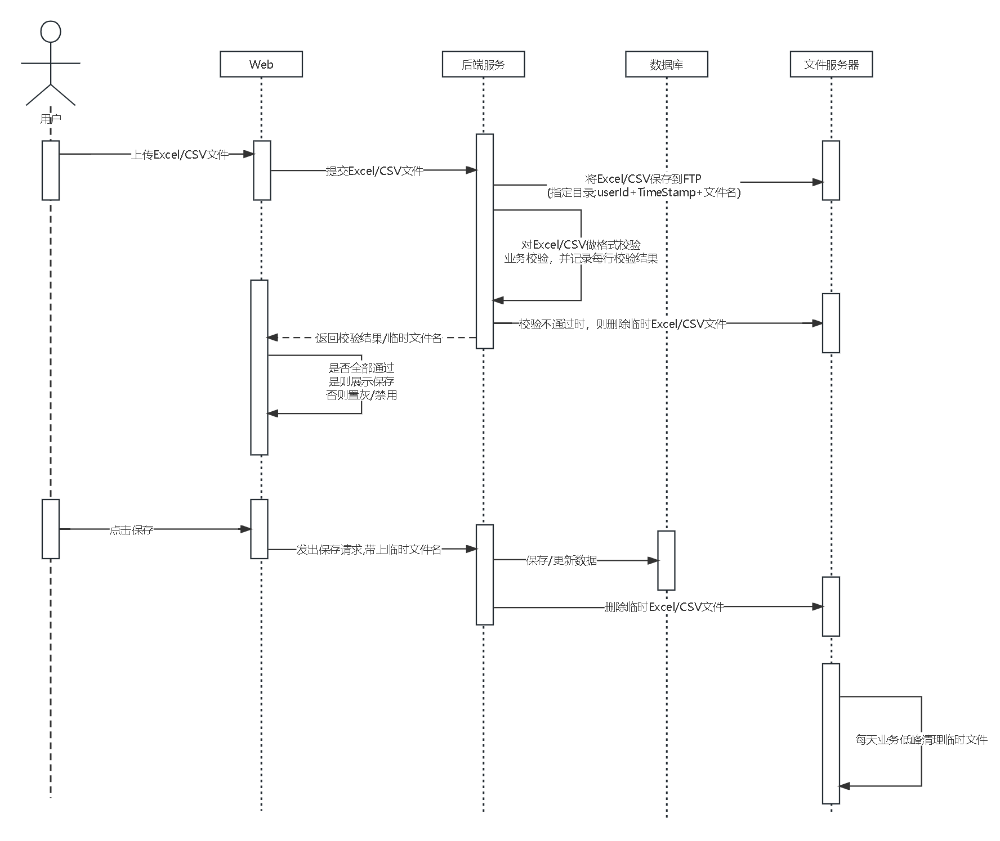

# EasyExcel预研

## 预研目标

> 目前项目`fastboot-parent`里面已经有`excel组件`，但是技术比较老，现在是想预研`EasyExcel`是否具备Excel和CSV（最好是能支持，不能支持看是否有备选方案）的导入导出能力，能否集成到`fastboot-parent`中新增一个组件。
>
> 
>
> 不是把之前的老的Excel组件替换成EasyExcel，而是把`EasyExcel`集成到`fastboot-parent`中，现在的版本有需求涉及Excel/CSV导入导出能力，然后直接使用这个新组件。

> 技术实现手段：
>
> - 使用`si-scada`项目引入`EasyExcel`，是否有版本兼容性问题。<strong style="color:green">添加依赖OK，可以正常启动</strong>
> - 编写Excel/CSV导入导出，4个Controller接口。<strong style="color:green">支持Excel/CSV，准备编写测试用例</strong>
> - 使用PostMan验证。<strong style="color:green">CSV验证OK</strong>

> fastboot-dependencies修改EasyExcel的版本号
>
> 重构验证json，Date，DateTime转换类
>
> 

# EasyExcel技术评审

> 目标：支持Excel和CSV的导入导出和解析
>
> 现状是EasyExcel版本为2.2.7
>
> 技术选型策略：看EasyExcel的最新release版本是否支持Excel和CSV，然后API是否向前兼容。（既解决Excel/CSV同时支持，又尽量少修改历史代码；避免切换新jar包，历史代码需要适配修改的问题）

> 修改点：
>
> http://47.92.146.195:40462/unified-platform/fastboot/-/merge_requests/33
>
> 1. EazyExcel版本2.2.7升级到3.3.2
> 2. 涉及到的代码修改（主要是api变化导致适配修改，对现有逻辑无影响。）

> 集成到si-scada-biz中测试验证
>
> 1. CSV导入测试。
> 2. CSV导出测试。
> 3. Excel导入测试。
> 4. Excel导出测试。

# 导入导出组件预研

## 目标

- 导入导出只支持二维表格，表格中都是文本数据（不支持插入图片等二进制数据）
- 后端开发定义好导入导出表的表头(列)
- 导入->预览->确认导入->后端处理（新增/修改）
- 查询->导出
- 下载导入模板

## 测试要点

- 后端开发定义OV/DTO/Bean对象
- 暴露Query/Import/Preview/Save/Export五个接口
  - Query查询表头，前端生成Excel/CSV的导入模板。（待定.../宏林说是产品经理定义的,不需要开发实现）
  - Import导入数据，生成临时数据/文件
  - Preview预览，查询临时数据/文件
  - Save保存，临时数据插入/更新
  - Export导出数据，后端返回查询结果，前端生成Excel/CSV文件。

# 后端定义

```java
@Data
@EqualsAndHashCode
public class DownloadData {

    @ExcelProperty(value = "名称",index = 0)
    @NotBlank(message = "名称不能为空")
    @Length(max = 20, message = "名称长度不能超过20")
    @ApiModelProperty(value = "名称", required = true,example = "测试001abc", position = 0)
    private String name;

    @ExcelProperty(value = "创建时间",index = 1,converter = LocalDateTimeConverter.class)
    @ApiModelProperty(value = "创建时间", required = true,example = "2023-08-28 16:01:00", position = 1)
    private Date createTime;

    @ExcelProperty(value = "价格",index = 2)
    @ApiModelProperty(value = "价格", required = true,example = "123", position = 2)
    private Integer price;
}

// 注解里面定义了value为表头的中文名称,position为表的第几列,example为导出模板的样例
```

`@ExcelProperty(value = "创建时间",index = 1,converter = LocalDateTimeConverter.class)` 定义导出的表头,第几列,格式转换

`读Excel/CSV如果采用中文表头,则不根据表头来映射Bean字段,而是根据顺序读取`

```txt
-------------------------------表头英文跟Bean中属性字段映射顺序保持一致-------------------------------
name,createTime,price
haha,2023-08-23 14:35:00,123456
hehe,2023-08-23 14:36:00,987654


-------------------------------中文表头映射正确.csv-------------------------------
名称,创建时间,价格
haha,2023-08-23 14:35:00,123456
hehe,2023-08-23 14:36:00,987654

-------------------------------中文表头顺序不一致,但表内容是映射正确.csv-------------------------------
名称,价格,创建时间
haha,123456,2023-08-23 14:35:00
hehe,987654,2023-08-23 14:36:00

-------------------------------中文表头顺序不一致,表内容映射错误.csv-------------------------------
价格,名称,创建时间
haha,123456,2023-08-23 14:35:00
hehe,987654,2023-08-23 14:36:00

```


## 找一个满足上面要求的开源项目

- 导入Excel时，将Eacel保存到FTP中，然后新建导入临时表，让用户知道自己的临时文件
- 流程图
- 时序图




