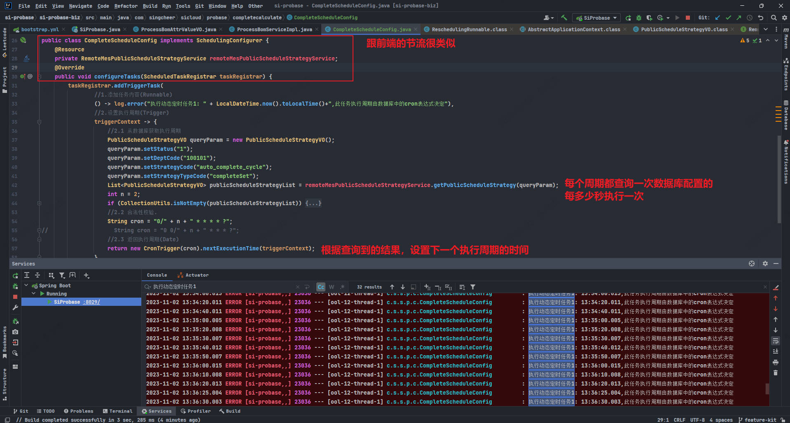

# 前端文件流、切片下载和上传：优化文件传输效率与用户体验
> https://juejin.cn/post/7255189826226602045


#### 定时任务执行周期可用热更新,热生效

参考方案

https://juejin.cn/post/7013234573823705102

还要考虑双实例不被重复执行的问题



```java
import com.alibaba.fastjson.JSONObject;
import com.singcheer.sicloud.mes.api.RemoteMesPublicScheduleStrategyService;
import com.singcheer.sicloud.mes.api.dto.PublicScheduleStrategyVO;
import lombok.extern.slf4j.Slf4j;
import org.apache.commons.collections.CollectionUtils;
import org.springframework.scheduling.annotation.SchedulingConfigurer;
import org.springframework.scheduling.config.ScheduledTaskRegistrar;
import org.springframework.scheduling.support.CronTrigger;
import org.springframework.stereotype.Component;

import javax.annotation.Resource;
import java.time.LocalDateTime;
import java.util.List;

/**
 * @Description 从排程策略-公共策略-齐套计算任务周期中获取
 * @ClassName CompleteScheduleConfig
 * @Author xuxiao
 * @Time 2023/11/2-11:12
 * @Version 1.0
 */
@Slf4j
@Component
public class CompleteScheduleConfig implements SchedulingConfigurer {
    @Resource
    private RemoteMesPublicScheduleStrategyService remoteMesPublicScheduleStrategyService;
    @Override
    public void configureTasks(ScheduledTaskRegistrar taskRegistrar) {
        taskRegistrar.addTriggerTask(
                //1.添加任务内容(Runnable)
                () -> log.error("执行动态定时任务1: " + LocalDateTime.now().toLocalTime()+",此任务执行周期由数据库中的cron表达式决定"),
                //2.设置执行周期(Trigger)
                triggerContext -> {
                    //2.1 从数据库获取执行周期
                    PublicScheduleStrategyVO queryParam = new PublicScheduleStrategyVO();
                    queryParam.setStatus("1");
                    queryParam.setDeptCode("100101");
                    queryParam.setStrategyCode("auto_complete_cycle");
                    queryParam.setStrategyTypeCode("completeSet");
                    List<PublicScheduleStrategyVO> publicScheduleStrategyList = remoteMesPublicScheduleStrategyService.getPublicScheduleStrategy(queryParam);
                    int n = 2;
                    if (CollectionUtils.isNotEmpty(publicScheduleStrategyList)) {
                        JSONObject handleOptionJsonObj = JSONObject.parseObject(publicScheduleStrategyList.get(0).getHandleOption());
                        JSONObject defaultValueJsonObj = JSONObject.parseObject(publicScheduleStrategyList.get(0).getDefaultValue());
                        if (1 == handleOptionJsonObj.getInteger("status")) {
                            n = handleOptionJsonObj.getInteger("value");
                        } else {
                            n = defaultValueJsonObj.getInteger("value");
                        }
                    }
                    //2.2 合法性校验.
                    String cron = "0/" + n + " * * * * ?";
//                    String cron = "0 0/" + n + " * * * ?";
                    //2.3 返回执行周期(Date)
                    return new CronTrigger(cron).nextExecutionTime(triggerContext);
                }
        );
    }
}

```
